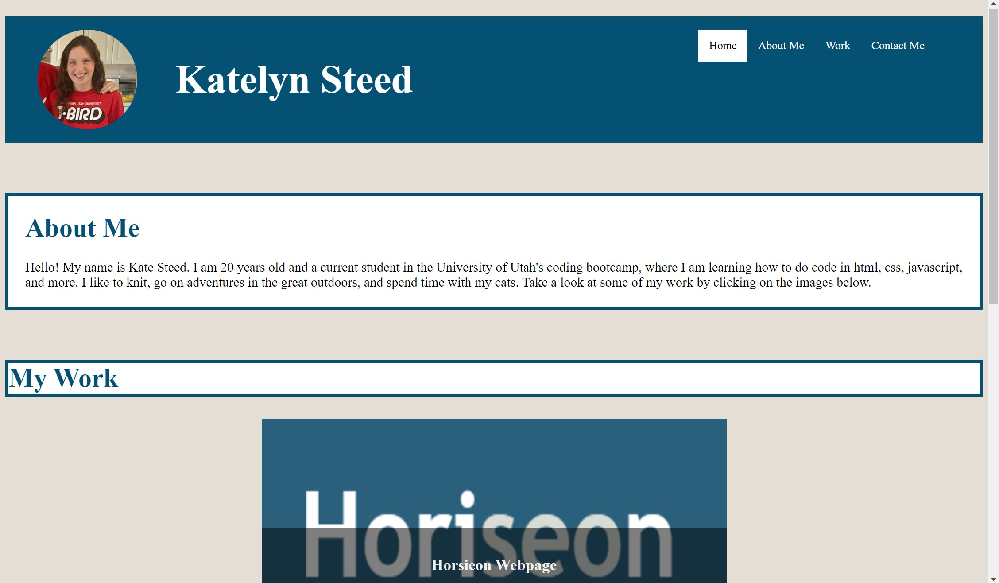
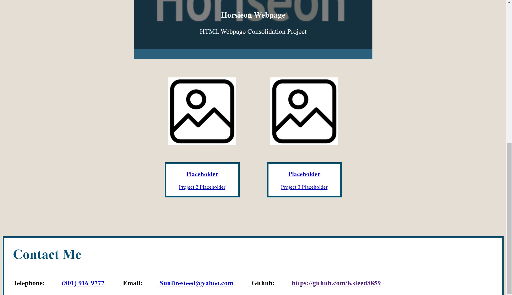

# Kate Steed Portfolio
## Description
This is an online portfolio for Katelyn Steed. This portfolio, created in html and css, serves as library for my works and projects. By clicking on the images on the page, potential employers can look through projects I've done in the past to determine if I might be a good fit for their company. While currenly only one project is connected to this portfolio, there is room for more as I gain more experience. 

## Instaliation
N/A

## Usage
The homepage of the website is a place where you can see all the works gathered in one place. To view an individual work in more detail, click on the image connected to the specific project.

https://ksteed8859.github.io/Kate-Steed-Portfolio/

## Credits
N/A

## License
N/A